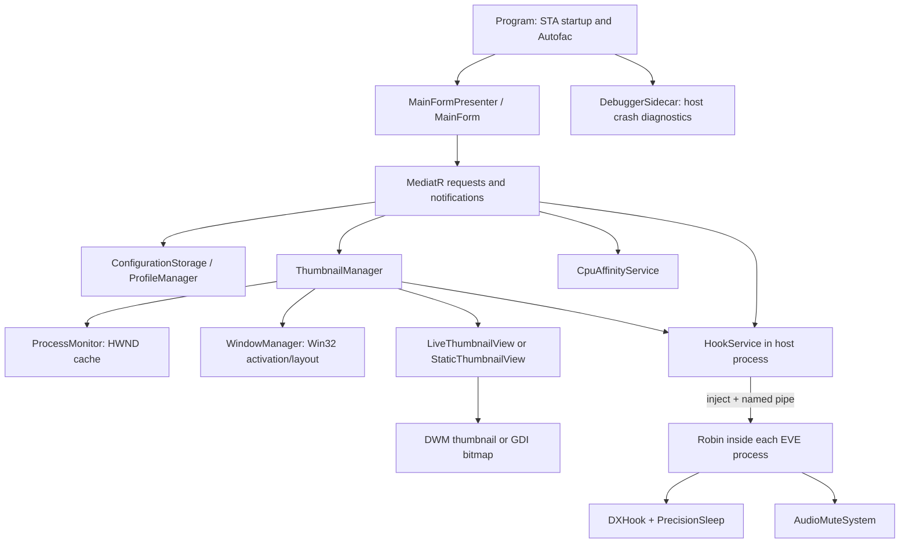

# EVE-O Preview: source and AI navigation guide

EVE-O Preview manages multiple EVE client windows: live or captured previews, rapid focus changes and cycling, layouts, FPS limits, CPU affinity, and selective audio muting. This guide is a reusable context entry point for understanding and changing the implementation.

Reviewed against commit `60944b521e3c5b442dd379b5208c53a91ae3a573` on 2026-09-06. The review covers the tracked application, injected library, tests, mock, project metadata, and release tooling. [The source index](docs/ai/source-index.md) records the complete baseline inventory and the treatment of resources and binary assets. This is a source-based navigation guide, not a claim that all native behavior has been exercised or benchmarked.

## Use this with an AI assistant

Start a coding session in `src/` and have it read [AGENTS.md](AGENTS.md). [The Git-root entry point](../AGENTS.md) also routes sessions opened above `src/` into these guides. For an assistant that does not load repository instructions, attach this README, the applicable detailed guide, and the source files for the task. A guide provides the map; the assistant still needs the current implementation and tests to make a reliable change.

The short `AGENTS.md` files provide discovery and local constraints, while the pages below hold deeper context. This follows the documented use of repository and directory instructions; Codex discovers instructions along the path from the project root to its working directory, with a size limit on the combined instructions. [Official OpenAI guidance](https://learn.chatgpt.com/docs/agent-configuration/agents-md).

| Guide | What it explains |
| --- | --- |
| [Reported bugs and investigation leads](docs/ai/reported-bugs.md) | Twelve tracked findings with evidence, current-version limits, workarounds, source routes and reproduction checks |
| [Future feature backlog](docs/ai/feature-backlog.md) | Nineteen unimplemented, partial or exploratory ideas with current-code checks and acceptance criteria |
| [Application and configuration](docs/ai/application-and-configuration.md) | Startup/shutdown, Autofac, presenter/UI contracts, every mediator route, shared settings, profiles and migrations |
| [Windows and thumbnails](docs/ai/windows-and-thumbnails.md) | Discovery, DWM/static rendering, overlays, MRU z-order, focus, hotkeys, prediction, CPU affinity, ownership |
| [Robin and native integration](docs/ai/robin.md) | Injection lifecycle, pipe bytes, DXGI vtable hooks, frame pacing, audio interception, sidecar diagnostics |
| [Build and test](docs/ai/build-and-test.md) | Project differences, precise Windows commands, native publishing, test coverage and limitations, release side effects |
| [Source index](docs/ai/source-index.md) | Every tracked baseline path, its role, and the guide to consult |

There are also local instructions for the [main app](Eve-O-Preview/AGENTS.md), [Robin](Eve-O-Preview.Robin/AGENTS.md), and [tests](tests/AGENTS.md). Read the relevant local file when navigating from a higher directory; do not assume every tool automatically loads instructions in child directories.

## Architecture at a glance



The main process owns desktop UI, persisted settings, discovery, and switching decisions. Robin runs inside each target process and affects its rendering/audio. A pipe reply proves communication, not that every native hook is healthy. The sidecar debugs the preview host, not the injected game processes.

## Find a feature quickly

Paths below are relative to `src/`. Search the symbol as well as the filename: namespaces do not always match folders, and the `Minimise*.cs` files contain `Minimize*` types.

| Symptom or task | Start here | Follow through |
| --- | --- | --- |
| Startup, second instance, tray exit | `Program.Main`, `GetInstanceToken` | `MainFormPresenter.Activate/Close`, `StartStopServiceHandler` |
| Setting does not save or reload | `MainForm` callback, `MainFormPresenter.SaveApplicationSettings` | `ThumbnailConfiguration`, `ConfigurationStorage`, corresponding handler |
| Profile switching/migration | `ProfileManager`, `ConfigurationStorage.Load` | `ChangeSelectedProfileHandler`, `SelectedProfileChangedNotificationHandler`, `GlobalEvents` |
| Missing/duplicate client preview | `ProcessMonitor.GetUpdatedProcesses` | `ThumbnailManager.UpdateThumbnailsList`, `ThumbnailViewFactory` |
| Stale, black, or flashing preview | `LiveThumbnailView.RefreshThumbnail`, `DwmThumbnail.Update` | `ThumbnailView.Refresh/ResizeThumbnail`, static compatibility path |
| Overlapping previews reorder/flicker | `ThumbnailManager` MRU and dirty state | `ThumbnailView.RestoreAndBringToFront`, `ThumbnailZOrderTests` |
| Focus/cycling delay | `ThumbnailManager` key and cycle methods | `WindowManager`, `CpuAffinityService`, `HookService`, Robin `DxHook` |
| Hotkey capture or duplicates | `CaptureNewHotkeyHandler`, `HotkeyHelpers` | `RefreshHotkeysHandler`, `CycleGroup`, manager key handler |
| FPS setting ignored | `SetFpsLimiterEnabledHandler`, `SetFpsLimiterHandler` | `HookService`, `NamedPipeServer`, `DxHook`, `PrecisionSleep` |
| Audio IDs rejected or sounds remain | `AudioMuteSettings.TryParseCustomMutedEventIds`, `MainForm.SaveCustomMutedEventIds` | `SetAudioSettingsHandler`, `HookService`, `NamedPipeServer`, `AudioMuteSystem` |
| CPU affinity regression | `CpuAffinityService.UpdateAffinity` | Cycle role selection, `UpdateCpuAffinityHandler`, reset handler |
| IDE tests missing/failing | Test `.csproj` and `Program.Main` | [Test Explorer and isolation notes](docs/ai/build-and-test.md) |
| Publish succeeds but injection fails | Robin native publish and deployment | DLL path in `HookService`, exported `Initialize`, target architecture |

Useful searches from `src/`:

```powershell
rg --files -g '*.cs' -g '*.csproj' -g '!obj/**' -g '!bin/**'
rg -n 'RestoreAndBringToFront|_thumbnailActivationOrder|_refreshThumbnailZOrder|DwmRegisterThumbnail' Eve-O-Preview
rg -n 'TryInstallHooksAsync|Initialize|Command|FocusType' Eve-O-Preview.Robin Eve-O-Preview/Services
rg -n 'SaveApplicationSettings|ChangeSelectedProfile|JsonProperty' Eve-O-Preview
```

## Performance mechanisms to understand before editing

| Mechanism | Why it matters | Detailed evidence |
| --- | --- | --- |
| Persistent DWM thumbnail registration | The compositor provides live content; a discovery tick is not a captured frame | [Rendering/lifetime](docs/ai/windows-and-thumbnails.md) |
| Dirty MRU z-order and nonactivating native restore | Keeps overlapping previews ordered without repeatedly showing/recreating WinForms windows | [Z-order and focus](docs/ai/windows-and-thumbnails.md) |
| Predicted next-client preparation | Cycling couples CPU assignment and Robin FPS state to the next likely focus target | [Cycling](docs/ai/windows-and-thumbnails.md), [native focus](docs/ai/robin.md) |
| Shared DXGI vtable patch and precise waiting | Hooks Present/Present1 in the target; frame pacing uses a high-resolution wait and final spin | [DXHook and PrecisionSleep](docs/ai/robin.md) |
| Guard-page/audio breakpoint interception | Selectively stops event playback after the call returns, using fixed bounded lookup data and exact native context layout | [AudioMuteSystem](docs/ai/robin.md) |
| Suppressed UI feedback and shared settings identity | Prevents reload/resize events from causing accidental writes or recursive updates | [Settings workflow](docs/ai/application-and-configuration.md) |
| Historical two-step mutex acquisition | Source records a Windows finalizer-thread failure behind an otherwise unusual startup pattern | [Startup](docs/ai/application-and-configuration.md) |

These are source-observed designs, not performance measurements. Before changing a performance path, describe the trigger, the cost being reduced, the invariant it protects, and a workload that can distinguish an improvement from a regression. Record client count, foreground/background/predicted roles, renderer, preview mode, monitor/DPI setup, logging level, and CPU topology where relevant.

## Prompt starters

Use the concrete task in place of brackets. Avoid asking for broad cleanup when the desired outcome is a feature-specific fix.

**Implement or fix a feature**

```text
Read src/AGENTS.md, src/README.md, and the guide for [feature].
Task: [trigger, current behavior, desired behavior].
Trace the current implementation through UI/configuration, mediator, services,
and Robin if involved. Name the files and invariants affected. Make the focused
change, run relevant checks, and update the guide if behavior changes.
Report what was verified and what still needs a real EVE/Windows run.
```

**Investigate a performance regression**

```text
Read the Windows/thumbnails and Robin guides plus the affected source.
Check docs/ai/reported-bugs.md for related BUG-IDs and historical evidence.
Regression: [action and observed latency/CPU/GPU/flicker].
Environment: [client count, DX mode, preview mode, monitors/DPI, CPU, FPS values].
Trace work done on each poll, switch, Present call, and audio exception that
is relevant. Separate measured evidence from hypotheses. Preserve DWM lifetime,
nonactivating MRU restore, prediction semantics, and native ABI requirements.
Use a repeatable before/after workload and explain any tradeoff.
```

**Extend persisted settings**

```text
Add [setting] with [default and scope]. Read the application/configuration guide.
Trace the model/interface, JSON contract, MainForm designer and callbacks,
presenter reload/save, handlers, and runtime application. Check existing and
missing fields, profile switching, invalid input, and save/load behavior.
If Robin consumes it, update both protocol endpoints and native validation.
```

**Review a proposed change**

```text
Read src/AGENTS.md and the relevant subsystem guide, then review [diff].
Check cross-process state, handle/delegate lifetime, focus and visibility,
configuration compatibility, UI-thread access, and hot-path cost where affected.
Report actionable findings with source evidence and a reproduction/check.
Do not treat the guides' investigation notes as proven runtime bugs.
```

## Keep this context useful

Add explanations close to an unusual implementation when its reason would otherwise be lost; use the existing symbol and link it from the guide. Directory `AGENTS.md` files already provide local guidance without adding repetitive AI tags to every source file. Avoid duplicating the entire guide into multiple assistant-specific files.

When changing code, update the relevant route, invariant, protocol table, or validation note in the same change. Refresh the source index when paths are added/moved. Preserve the distinction between intentional behavior, historical rationale, observed risks, and behavior proven by tests. Read the build guide before running release tooling; for this documentation review, no live game injection, crash sidecar, or release task is needed.
