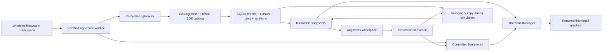

# Augments: combat logs, alpha, DPS and location

The [Thumbnail augments README](../augments/README.md) contains user-facing setup
and explanations. Keep the UI focused on labels, values and actionable feedback;
source metadata and recent entries are collapsed under each character's **Log details**. Simulation
always exposes the NPC/Player choice and matching SDE selections; direction and
repair controls appear for **Selected event**.

## User workflow

The **Augments** page is available in Light and Dark. Its current features augment
EVE-O thumbnails; they do not draw on top of the EVE client. The internal module
ID remains `Dps` for compatibility with the reserved workspace extension route.

1. In **Data setup**, enable reading. Automatic detection uses Windows' Documents
   known folder, including redirected/OneDrive Documents. If that location has no
   log subfolders, detection also checks the conventional user Documents folder.
   The selected path is displayed. Enable game-message and Local chat logging in
   EVE; the reader cannot enable the client's own logging.
2. **Advanced: custom log folder** contains a folder picker, manual absolute path,
   Apply and **Use automatic location**. Select the parent of `Gamelogs` and
   `Chatlogs`. Custom paths persist across profiles. Reconciliation also retries
   automatic detection. Missing folders are watched for creation.
3. **Thumbnail augments** opens on **All thumbnails**, the shared configuration
   for existing and future clients. A collapsed **Per-client settings** section
   supports exact `EVE - Character` overrides and returning to shared defaults.
   Simple mode provides Classic, Damage colours and Minimal presets. Classic and
   Damage colours start with **Alpha + DPS**; Minimal starts with **DPS only**.
   Simple mode has **Show DPS**, **Show alpha** and **Show weapon icons** switches.
   Advanced retains the **Damage display** choices. Both modes share weapon
   visibility through `CustomAppearance.ShowWeaponIcon`; Simple otherwise uses
   preset styling and retains saved Advanced colours/symbols. Changing presets
   resets the appearance as before. Hiding alpha preserves the icon preference.
   Location and repair visibility are independent. **Previews & layout → Title &
   highlight → Current solar system** owns system visibility, colour, relative
   placement and size, applying edits to the defaults and existing per-client
   entries without changing their combat customisations. Below the title and
   inherited title size remain the defaults; no placeholder is drawn until known.
   Combat theme/mode changes retain system appearance. Nullable `SystemColor`
   preserves older appearance colours until edited; nullable `SystemFontSize`
   inherits the title size. These settings retain the existing global log-settings
   persistence route behind the preview editor's normal draft/Apply controls.
4. Advanced mode provides incoming/outgoing DPS selection, NPC/Player
   breakdown, font size, offsets, nine-position placement, row order and event duration. Damage
   text can retain direction colours or follow damage type / weapon platform.
   These modes colour alpha; DPS retains direction colours. Icon/text editors
   disable when their alpha/visibility/mode dependency is inactive. The simulator
   identifies resolved weapon platforms and can enable alpha plus weapon icons
   using the saved display settings, including existing per-client settings,
   without changing configuration mode or discarding custom styles.
   Damage, platform and repair icons each have independent icon and text colours.
   Each style header includes `OverlaySymbolPreview`, using the same shared
   polygon/stroke geometry as real thumbnails. Its colour follows valid draft
   edits and its symbol follows saved selection changes, even when alpha is hidden.
   `#RRGGBB` fields require Apply; unapplied fields
   survive navigation and participate in the existing close/profile guard.
   Position/order and font controls have separate sections; expanded sections
   survive edits. `LogOverlayOptions.Position` is nullable so old Top/Bottom
   preferences retain their meaning. `TitlePosition` uses the shared preview
   settings route. `OverlayLayout.Arrange` measures both blocks before rendering,
   stacking title/system above DPS when positions match. Renderers share the
   same layout; native split assets retain the complete layout calculation.
5. **Simulate** runs on all visible thumbnails by default, or the selected client.
   Choose **NPC** with a faction and/or ship, or **Player** with a compatible
   weapon/ammo pair. Choices come from the installed SDE. Weapon and ammunition
   use standard `ComboBox` dropdowns with visible scrollbars and disabled weapon-platform headings; ammunition remains
   filtered by the selected weapon. NPC ship selection retains its searchable
   picker. **Mixed combat** varies damage direction
   while retaining the chosen combatant/profile; a separate logistics cadence
   alternates incoming/outgoing shield and armour repairs as Player events;
   **Selected event** fixes direction/effect. **Incoming and outgoing repairs
   together** sets `CombatSimulation.BothRepairDirections`, pairing repairs at
   each logistics cycle in either scenario; it disables the single direction
   selector for selected repairs. `SimulationEvents` previews both generated
   entries using the same formatter. Runs default to 20 seconds
   and are bounded to 60; **Stop simulation** restores real data immediately.
   Events use the same combat notification, aggregation, alpha/DPS/repair rendering
   and overview indicators as real logs, without TEST labels. Temporary statistics
   appear in the overview during the run and are discarded on Stop/expiry. Real
   ingestion and its saved totals continue throughout. There are no game inputs
   or writes to EVE files, and simulated entries never reach the disk database.
   The host resolves selected IDs again before starting; invalid or incompatible
   selections do not replace an active run. **Any ship** selects one NPC per
   thumbnail from the chosen faction, preserving its independent gun/missile
   cadence and damage evidence. Player-only alerts never receive NPC damage.
   NPC mixed/outgoing scenarios also select the user's own weapon and ammo;
   NPC guns are never reused as the user's outgoing attacks. Each side has its
   own cadence. UI simulations produce invariant-culture log text and pass through
   `EveLogParser` before the memory store and `CombatEvent`. Missile/rocket logs
   name ammunition; turret logs name modules and cannot reveal hidden charges.
   The lower-level non-SDE event seam remains for renderer regression fixtures.
   Selected repairs bypass weapon/ammo resolution and retain their own cadence.
   A conditional enable-repairs action updates the same production visibility
   setting for the selected target(s); simulation never bypasses those settings.
6. **Incoming damage indicator**, in **Thumbnail augments**, selects **Title**,
   **Thumbnail**, or **Both**. Older preferences retain Title. Title includes the
   Overview name; Thumbnail uses a configurable 0–100% translucent wash (20% by default).
   `FlashOpacityPercent` controls the peak thumbnail alpha, independent of title colour.
   Both share the enable switch, colour, duration (1–10 seconds, 2 by default),
   and **Player only** or **NPC + Player** filter.
   **Flash interval (ms)** sets a 100–2000 ms cycle (500 ms by default), half in
   the flash colour and half in the original colours with **Blink**. **Fade** is the default and uses
   a smooth cosine rise/fall at the same interval and tapers at expiry. Both targets
   use `CombatDamageFlash.Evaluate`. Blink schedules its next boundary; Fade uses
   finite 30 Hz ticks only while damage remains active. The manager's fade path
   updates colour/opacity without formatting DPS or reconstructing appearances.
   One frame provides the name state, intensity and `ThumbnailTint`, applied atomically via
   `ThumbnailView.SetDamageFlash`; the same source filter and burst clock apply.
   Positive incoming damage triggers it; outgoing hits and repairs do not. The
   name returns to its configured colour on expiry, including when no new logs arrive.
   The full duration starts on receipt, not the whole-second log timestamp. Default
   sources are NPC + Player; an existing explicit Player-only selection is preserved.
   Burst start times are retained separately for all incoming damage and player
   damage. New hits extend the deadline without resetting the phase, so rapid
   damage cannot leave the name continuously highlighted. These times remain
   transient, with real/simulation state isolated and restored on Stop.
7. Missing FC static data prompts once per session before any automatic download.
   Declining preserves basic logs/augments and disables SDE-dependent simulation.
   **Data setup → FC static data** downloads/updates the complete SDE, with progress,
   cancellation and offline reuse. See [static data](static-data.md) for storage and evidence rules.

Alpha means **one logged hit**, not an inferred simultaneous volley from several
weapons. Live presentation retains separate newest incoming/outgoing damage
events per character for 1–15 seconds (3 by default); every parsed hit still
contributes to totals. The incoming/outgoing rows keep fixed positions even when
their DPS is zero and hidden. Each direction's alpha is an inline suffix beside
its DPS, with the `α` prefix and damage/platform icons. DPS itself has no icons
or type colouring. Alpha icons show only known damage components and enabled weapon platforms.
Module-only turret hits retain their platform icon; missing metadata never adds
an automatic unknown marker. Stored evidence and totals remain unchanged.
Two fixed repair rows are reserved when repairs are enabled, incoming then outgoing.
They move together in the selected row order. Each row
starts with one `IN`/`OUT` text segment, followed by compact icon/number pairs for
active shield, armour and hull rates, both
in the configured repair icon colour. `CombatLogStore.Snapshot` sums every source
and cycle in the full rolling window, independently of the 100-entry recent list,
and divides by window seconds. `RepairRates` drives live and simulation overlays;
repair-only activity keeps the existing 250 ms display timer awake until expiry.
`CombatSimulation.RepairSourceCount` selects 1-20 pilots; `MixedRepairTypes`
distributes them across the three types, with `BothRepairDirections` pairing each.
Timed multi-source runs alternate one source and all selected sources; mixed
combat uses mixed types for combined samples. The host passes `WindowSeconds`
into `CombatSimulationSequence`. Samples are spaced by `max(3, windowSeconds)`
so the prior rate sample expires naturally before the next. Neither simulation
history nor live counters are cleared to manufacture that transition. A window
longer than the selected run allows only the initial sample. One-source streams
keep their prior cadence; zero-duration fixtures emit all sources once. `CombatOverlayFormatter.AppearanceSample`
combines both damage directions and all repair types for the settings preview,
respecting visibility options without changing the selected simulation request.
Missing/invalid SDE selections keep basic appearance samples available while
simulation validation remains separate. The Data setup tab contains logs and FC
static data; its identity is broad enough for future data sources.
DPS is damage in `(now - window, now] / windowSeconds`, independently for each
direction and NPC/Player category. The default is a fixed 10-second
window, configurable from 1 to 300 seconds. In/out totals are perspectives, not
deduplicated fleet damage: two tracked characters damaging one another can
observe the same exchange on opposite sides.

## Implementation route

- `Program.CreateApplicationContainerBuilder` registers the single
  `CombatLogService` and `IWorkspaceCombatLogs`. The Windows backend forwards the
  capability and `WorkspaceForm` registers `CombatLogView.CreateModule`.
- `EveLogDirectory` owns automatic folder selection. `CombatLogService` owns
  watchers, a bounded/coalesced wake channel and one worker; UI callbacks never
  open EVE files or SQLite. Settings live in `ApplicationPreferences.CombatLogs`.
- `CompleteLogReader` opens read-only with `FileShare.ReadWrite | FileShare.Delete`
  and closes the handle before parsing/storage. Windows volume/file identity and
  creation time survive renames. Durable byte offsets, generations and a trailing
  anchor detect normal replacement/truncation. UTF-8 and BOM-marked UTF-16 LE/BE
  are framed at complete newlines. A split BOM, CRLF, code point or final entry
  remains pending; it is never emitted as a partial event. Batches are limited to
  1 MiB and lines to 64 KiB, with oversized lines discarded through their newline.
- `EveLogParser` reads listener/session/channel headers. Listener name joins the
  existing `CharacterIdentityCache` by exact name; known character IDs enrich
  snapshots without a new HTTP request per event. EVE account/user IDs, HWNDs,
  PIDs and numeric log filename suffixes are not interchangeable character IDs.
  Conflicting listeners invalidate a source and retract its prior contributions.
- `CombatLogStore` uses `Microsoft.Data.Sqlite` in the host, with WAL and atomic
  entry/offset/total commits. No database dependency enters Robin or the portable
  UI. `Logs/Combat.sqlite` is beside the resolved global settings file, following
  the existing portable/AppData policy. No EVE directory is written to.
  The native dependency is pinned through `SQLitePCLRaw.bundle_e_sqlite3` 3.0.5
  (SQLite 3.53.4), avoiding the old 2.1.11 transitive native library. See the
  [maintainer's upgrade guidance](https://github.com/ericsink/SQLitePCL.raw/blob/main/v3.md)
  and [old native library advisory](https://github.com/advisories/GHSA-2m69-gcr7-jv3q).
- `CombatLogStore.Activity` owns the version-2 activity tables and durable hit counts, maxima,
  distinct damage counterparties and repair totals/counts. Contributions remain
  per source so an ambiguous listener retracts everything even after retention.
  A per-generation committed entry offset prevents old batches being counted again
  after pruning/reset. The activity snapshot is cached until a commit/reset;
  rolling-DPS display ticks do not reaggregate durable travel/target history.
  Migration backfills retained entries once and records a separate `ActivitySince`
  rather than inventing counters for pruned history. Migration and commits are atomic.
  `system_visits` retains compact Local observations plus a pre-period baseline
  per source. Queries deduplicate equal observations, omit timestamp conflicts,
  order across files, and count system changes after the first known location.
  Reset seeds the newest known system and keeps file positions; first location
  and same-system reconnects are not jumps. Travel evidence persists until Reset.
- `CombatLogStore.Dps` upgrades the database to schema version 3. Per-source,
  generation, character, direction, kind and timestamp damage buckets retain the
  evidence needed for delayed-file ordering and ambiguous-source retraction after
  raw-entry pruning. Each stream stores cumulative accepted damage/time and a short
  pending tail. Complete inter-hit intervals must lie at least ten seconds inside
  each end of a positive-damage period; gaps over sixty seconds begin a new period.
  The separate idle threshold accommodates slow artillery volleys. Logs cannot
  distinguish all cooldowns/reloads from idle gaps. Zero hits and repairs never
  extend a damage period. Normal commits update only the pending tail; late files
  rebuild only affected streams. All writes share the entries/cursor transaction.
  Version-2 migration backfills retained damage once with a separate `AverageDpsSince`;
  it preserves totals, file positions and alerts. Damage/All reset clears these
  samples; Repairs/Jumps reset keeps them. Averages survive idle time and restart.
- `CombatLogStore.Reset` adds schema version 4 with per-character reset cutoffs.
  The overview popup captures its selected character when opened and forwards that
  scope through the host/service to real and simulation stores. A null character
  means all characters. Selected resets delete only that character's relevant
  contributions, seed its travel baseline, retain file positions, and reject old
  replay by timestamp after restart. Global measurement starts and other characters'
  counters/indicators remain unchanged. Cutoffs are cached on the ingestion worker.
- `CombatLogView.Overview` keeps one button row per character with a cached public
  portrait, name and combined status. Enter/click selects a detail view; the selected
  character survives workspace/language rebuilds through `CombatLogDrafts`.
  Normal snapshots update existing controls so focus and expanders remain stable.
  Detail counters use immutable `CharacterActivityStats`; portraits use the existing
  host portrait/identity capabilities and retain initials when unavailable.
  A combined card above the character list sums damage, hits, repair HP/cycles and
  jumps, takes the largest hit per direction, and weights DPS by valid sample time.
  It does not sum distinct targets/systems across characters or merge in/out into
  unique fleet damage. Detail averages show `-` until samples qualify; thumbnail
  and list-row DPS retain their live rolling behavior. Repair tables use only
  Incoming/Outgoing columns with explicitly labelled HP and cycles.
- `CombatLogService.Simulation` runs the finite `CombatSimulationSequence` on
  the existing worker. `CreateMemoryCopy` uses the same schema and aggregation;
  both real and synthetic entries reach this copy, while only real entries reach
  the original database. `AcceptCombatEntry` is the shared event dispatch for
  augments and future audible/animated alerts. Ending the run disposes the copy,
  restores real snapshots and restores any still-current real transient event.
- `CharacterSystemCache` is a shared singleton independent of combat totals.
  `Observe` accepts a character, system name and observation time; `GetSystem`
  returns the latest name. Old replay cannot regress it. Log snapshots seed it,
  reset/disabled ingestion does not erase it, and future ESI can use the same
  update path. Its change event updates thumbnails without requiring combat.
- `ThumbnailManager.CombatLogs` coalesces events onto its owning dispatcher and
  updates retained stats. Its finite expiry timer never reads EVE files. The
  worker clock also schedules the Local-tail fallback described below.
  Native composition and compatibility rendering use
  `OverlaySceneRasterizer`; the settings preview uses `AvaloniaPreviewOverlay`.
  `OverlayStatsStyle` uses preview-client pixels. Ordinary updates retain DWM
  relationships, focus, image dimensions and MRU z-order.
- `CombatOverlayFormatter.Meter` shares fixed rows and inline alpha between the
  live meter and settings preview, including hidden slots and independent hit expiry.
  `CombatOverlayFormatter` shares direction/repair colour
  and icon selection. `OverlaySymbols` loads the four embedded SVG polygon assets
  once; both renderers draw the same geometry with configurable colours. See the
  [SVG provenance and editing notes](../../Eve-O-Preview.Preview/Assets/Damage/README.md).

Startup/reconfiguration/recovery subscribes watchers **before** enumeration.
Reconciliation considers files modified within the retention period and already
checkpointed files. Each file remains independent; creating a new file never
stops following an older file for the same listener. Older, previously unseen
files are picked up when they change. The reader watches Game logs and **Local**
chat logs only, including directory creation/rename. Duplicate notifications
coalesce by path; overflow replaces watchers and reconciles from durable offsets.
Failures yield to the writer and schedule at most four retries (50, 250, 1000,
5000 ms); further changes or the visible Retry action can resume reading. There
is no recurring directory scan. A 250 ms worker wake checks the length through a
shared read handle for the newest known Local session per listener. Windows can
delay Size/LastWrite notifications for cached writes until the writer closes,
even when a complete system-change entry is already readable. Changed lengths
queue the normal complete-line reader (including truncation); unchanged files do
not read content, parse or commit. The probe compares against the last checked
byte length, so an unchanged partial line does not cause repeated reads.
Older Local files and game logs remain notification-driven. The fallback stops
when reading is disabled/stopped and preserves the bounded access-failure retries.

## Data and inference limits

The first database creation starts the measurement; overall combat totals survive
restart until Reset. Overview's reset flyout selects `CombatResetScope.All`,
`Damage`, `Repairs` or `Jumps` for every character. `CombatLogService` serializes
scoped reset through its worker into the real and active simulation stores.
`CombatLogStore.Reset` updates matching entries, counters and persistent cutoffs
in one transaction; in-memory cutoffs/cache change only after commit. Scope `All`
clears all history/counters; partial resets preserve unrelated counters. Location
knowledge, source cursors and high-water marks survive. Scoped cutoffs prevent
newly discovered older files from repopulating reset counters. Travel seeds a
current-system baseline. Cancelling the flyout never calls the backend. Historical files
bootstrap listener/location state; pre-measurement combat is not added to totals.
Recent parsed entries keep 1–30 days (7 by default), capped at 200,000 during
periodic cleanup on worker activity. Retained entry history is bounded separately
from overall per-source totals and checkpoints. Local chat conversations are
neither stored nor displayed. Future timestamps more than two seconds ahead are
excluded. The small accepted clock skew still ages into/out of the DPS window.

The product uses exactly two categories. Known character names and standard
`pilot[ticker](ship)` labels identify players; exact SDE Entity-category names
identify NPCs. Other labels count as Player by policy. This fallback is not an
authenticated identity result: custom labels can obscure an NPC match. Historical
unclassified entries/totals are read under Player without replay or data loss.

Weapon/platform matching uses exact, longest SDE names. Named damaging items take
priority over NPC gun attributes; a turret alone does not identify player ammunition.
NPC-only quality suffixes use the exact NPC attack profile. Each known damage
component has its own configurable icon on that hit's alpha suffix. Missing
damage or platform metadata adds no placeholder icon. Rolling DPS keeps plain numeric values;
its damage composition remains available in snapshots for future consumers.
No per-type applied damage amounts are invented. See [static data](static-data.md)
for NPC missiles, fixed-damage modules, alias ambiguity and evidence metadata.

### Future ESI ammunition cache

FEAT-020 in the [feature backlog](feature-backlog.md) records a future investigation
after authenticated ESI integration: determine whether ESI can identify currently
loaded ammunition, then cache confirmed values until a reload message invalidates
them. A live reload check produced `Loading the Projectile Ammo into the Projectile
Weapon`, which supplies a refresh trigger but no exact ammo name. Verify endpoint
coverage, module association, response freshness and cache/rate limits before
implementation. Refresh after reload completion only when fresh data is available;
ship/session changes also invalidate the cache. Omit stale or ambiguous values and
retain direct log evidence as authoritative. ESI capability is not yet established.

### Language and catalog coverage

Damage direction and listener/session patterns cover the six researched client
languages (English, German, French, Russian, Japanese and Chinese). Current Local
system-message and remote shield/armor/hull-repair patterns are English. Local
location requires the Local header, exact EVE System message and a known SDE
system; player chat cannot impersonate a location event by mentioning one.
Unsupported game text remains a recent parsed entry and contributes to a visible
unrecognized/non-damage count, without being silently counted as zero damage.
Source counts mean observed source files, including older sessions. The current
system is the latest known name, retained in memory for reuse. Observation times
remain available internally and in the overview; the thumbnail shows only the name.

The embedded fallback comes from FC JSONL SDE build **3503375** (2026-09-10):
39,020 normalized NPC aliases, 25,723 NPC attack profiles, 14,427 system aliases
and 15,566 weapon/item aliases. The production SDE index is also used by the
[generator](../../scripts/generate-log-catalog.py), preserving matching rules.
Runtime now downloads and manages the complete SDE; see [static data](static-data.md).

## Validation

The final Windows suite passed **201/201**; the workspace smoke passed **180**
production renders and the portable overlay smoke passed. Tests include temporary
synthetic writers, split Unicode, old/new concurrent logs, exclusive sharing,
watcher recovery, restart, storage rollback, classification, simulation isolation,
real native thumbnail graphics/focus and SVG colour pixels. Light/Dark captures
were inspected for Simple/Advanced configuration and alpha/DPS/repair appearance.
The built Windows executable also passed `--validate-workspace` startup with exit
code zero, using isolated configuration and no live EVE integration.
An opt-in live validation then exercised three running EVE clients for 12 seconds:
35 simulated events used production notifications and transient overview totals;
Stop/expiry restored real totals, with zero persisted simulation entries. All three
current systems were detected and shown as plain subtitles. Thumbnail captures
confirmed the actual thumbnail name colour, all four incoming damage icons, normal
production text and repair icons. Indicator settings are in Thumbnail augments. Foreground focus and the three
DWM registrations remained unchanged. This uses isolated application settings and
history with real EVE windows/logs; it does not replace the already-running app.
The subsequent inline-alpha update passed 29 combat checks, 13 native renderer
checks, 184 UI renders and portable rendering checks. Exact pixel comparisons
verify fixed outgoing-row positions when incoming hides, for top/bottom layouts.
A two-client live run received 18 events and verified inline alpha, title colour,
restored totals and zero persisted simulation entries. Both DWM registrations
and foreground focus remained unchanged. These checks use simulated combat.
The subsequent blink/font update passed 67 focused combat, native rendering,
title-preview and thumbnail-input checks, 188 workspace renders and the portable
renderer smoke. Coverage includes periodic overview/native name transitions,
rapid-hit phase retention, source filtering, saved intervals, shared title/DPS
glyphs, font inheritance, overrides, reset and drafts. A further two-client live
run verified blinking, Minimal alpha icons, spaced alpha values and shared font
override/reset, with 16 events, unchanged focus/DWM counts and no persisted
simulation entries. Captured normal/flash phases and font overrides were inspected.
See [build and test](build-and-test.md#augments-checks-2026-09-13) for commands,
dependency packaging and the distinction between these checks and live gameplay.

## Research and design (2026-09-13)

The implementation reads the client's files in the host process. It does not add
anything to Robin or the game process. Relevant primary sources:

- [PELD's reader](https://github.com/ArtificialQualia/PyEveLiveDPS/blob/master/PyEveLiveDPS/logreader.py)
  establishes localized listener/session headers, damage direction and formatted
  combat text. Its overview-dependent extraction is evidence that a label is not
  always an unambiguous pilot name. Its single-newest-file replacement policy is
  insufficient for overlapping files, so this implementation tracks each file.
- [SMT's reader](https://github.com/Slazanger/SMT/blob/master/EVEData/EveManager.cs)
  uses shared reads and Local channel system messages for location. Game logs are
  UTF-8; Local chat logs can be UTF-16.
- [FileSystemWatcher](https://learn.microsoft.com/en-us/dotnet/api/system.io.filesystemwatcher)
  can deliver duplicate notifications and lose notifications on buffer overflow.
  Callbacks therefore only enqueue work; durable offsets determine what is new.
- [ReadDirectoryChangesW](https://learn.microsoft.com/en-us/windows/win32/api/winbase/nf-winbase-readdirectorychangesw)
  explains that cached size/last-write notifications can wait for a disk flush.
  The synthetic held-open writer check therefore flushes its own test writes;
  the production reader never flushes or modifies the source.
- [FileShare](https://learn.microsoft.com/en-us/dotnet/api/system.io.fileshare)
  permits read/write/delete sharing. Reads must yield on sharing or range-lock
  failures, never acquire a lock, and never write to the EVE log directory.
- [SQLite transactions](https://learn.microsoft.com/en-us/dotnet/standard/data/sqlite/transactions)
  provide atomic entry/checkpoint commits, preventing replay duplicates or skipped
  damage after a process crash.
- [FC's static data](https://developers.eveonline.com/docs/services/static-data/)
  supplies exact NPC/item names, attack attributes and solar-system IDs. The complete
  export is managed by the [static data service](static-data.md), with offline reuse
  and background updates. Parsed damage evidence records the build used.

Acceptance criteria:

1. Event-driven creation/change/rename handling, watcher-before-scan startup and
   overflow reconciliation. No recurring filesystem scan. A targeted 250 ms
   latest-Local length probe handles delayed notifications from open writers;
   bounded access retries remain separate.
2. Read-only, short-lived handles with ReadWrite/Delete sharing. Only complete
   newline-terminated entries cross the parsing boundary, including split BOMs,
   UTF-8 characters, UTF-16 code units and CRLF. Bound memory for malformed lines.
3. Independently checkpoint every file; follow concurrent files and rotation,
   validate replacement/truncation and reject conflicting listener headers.
4. Listener name is authoritative; match exact character names to the existing
   public identity cache. Account IDs and filename suffixes are not character IDs.
5. Persist parsed game entries and location events locally with a retention bound;
   retain overall damage totals since reset. Rolling DPS uses UTC log time over a
   configurable fixed window and decays to zero without further log writes.
6. Use a binary NPC/Player breakdown, matching known NPC names and treating other
   targets as Player. Keep that classification policy distinct from ID resolution.
7. Modern workspace provides real totals, source breakdown, status and settings;
   per-title overlay choices include incoming/outgoing DPS and last-known system.
   Telemetry changes only retained graphics, not DWM lifetime, z-order or focus.
8. Automated checks exercise synthetic concurrent writes, restart, rotation,
   partial entries, classification, timestamp ordering, settings and actual UI
   rendering. Live EVE gameplay/flush latency remain a separate validation.

Filesystem notification timing can depend on the client's flush to disk. Local messages
are the last observed system, not authoritative online presence; stale/offline
locations remain the current known value until better information arrives. Missing logs and unsupported message
formats must be visible, not represented as a successful zero-DPS measurement.
