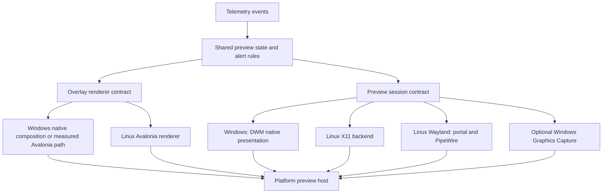

# Preview rendering technology review

This document records rendering architecture decisions and remaining platform work. Current Windows implementation and validation boundaries are tracked in the [preview rendering guide](preview-rendering.md). Avalonia owns production windows and lifetime; Linux capture/input backends remain future work. Scope: rich preview graphics, platform-specific image backends, and preservation of existing functionality.

## Recommendation

Implementation outcome: the subsequent comparison selected **DWM plus native DirectComposition overlays for Windows**. The portable Avalonia overlay remains a separate candidate for other platforms. See [current validation and open acceptance gates](preview-rendering.md#current-validation-and-open-acceptance-gates) for the measured scope and remaining gaps; the original investigation below is not an absolute fastest-renderer claim.

Windows is the first-class platform. Preserve its complete feature set and prioritize its performance; Linux may expose fewer capabilities. A small measured portability cost is acceptable, but a material Windows regression is not. Linux readiness must not delay Windows features or force a common-denominator renderer.

Retain DWM as the normal Windows image presenter and DirectComposition as the enhanced overlay renderer. Avalonia owns settings, thumbnail and overlay top-level windows while Windows adapters enforce native focus, pixel geometry, compositor ownership and recovery. Image presentation and overlays use independent platform contracts. Linux can use the portable Avalonia vector renderer and its own capture implementation without replacing the Windows native path.

Do not require every backend to produce bitmap frames: DWM is a native presentation relationship, while a Linux backend may deliver GPU textures. Add a Windows Graphics Capture backend only where image-level effects or measured benefits justify it. Capture, copies, transparency, window count and scheduling can dominate toolkit differences; benchmark the complete preview path. No renderer has been proven fastest by this investigation.

## Current source evidence

- [LiveThumbnailView](../../Eve-O-Preview/View/Implementation/LiveThumbnailView.cs) maintains a persistent DWM relationship. The discovery/maintenance timer does not render every game frame.
- [DwmThumbnail](../../Eve-O-Preview/Services/Implementation/DwmThumbnail.cs) supplies native registration, bounds and property updates. Microsoft describes DWM thumbnails as live source/destination relationships; its public thumbnail API does not expose a texture for arbitrary shader processing. [DWM overview](https://learn.microsoft.com/is-is/windows/win32/dwm/thumbnail-ovw).
- [ThumbnailView](../../Eve-O-Preview/View/Implementation/ThumbnailView.cs) is an Avalonia top-level owning geometry, hover zoom, gestures, highlight, opacity and nonactivating restoration. The [overlay](../../Eve-O-Preview/View/Implementation/ThumbnailOverlay.cs) is a separately owned transparent Avalonia top-level receiving a native DirectComposition target. Compatibility fallback uses cached raster assets in Avalonia controls, without a transparency key or HWND recreation.
- [IThumbnailView](../../Eve-O-Preview/View/Interface/IThumbnailView.cs) still exposes native identity, System.Drawing geometry and host services. It is not the future portable contract.
- [Eve-O-Preview.UI](../../Eve-O-Preview.UI/Eve-O-Preview.UI.csproj) already targets net10.0 and pins Avalonia 11.3.20. [WorkspaceContract](../../Eve-O-Preview.UI/WorkspaceContract.cs) establishes the portable command/snapshot boundary.
- [Augments](combat-logs.md) supplies log-derived combat, repairs and location scenes independently of the image and graphics adapters.

## Technology comparison

The suitability judgments below are engineering assessments for this repository, not measured rankings.

| Technology | Fit and tradeoff | Decision |
| --- | --- | --- |
| Avalonia composition, with selective custom Skia drawing | Reuses C#, settings controls and styling; supports render-thread composition and custom drawing. Native capture remains backend work. | Preferred portable candidate; Windows adoption is performance-gated. |
| Qt Quick / QML | Strong GPU scene graph, batching and native graphics integration. Would introduce a second UI stack and substantial C++/QML integration or rewrite. | Strong alternative for a new native application; insufficient benefit here without benchmark evidence. |
| Native Windows composition with Direct2D/DirectWrite | Direct control over Windows visual surfaces and animations; requires explicit input, DPI, menus and resource lifecycle engineering. | First-class Windows overlay candidate, even if Linux needs a separate renderer. |
| Flutter | Supports Windows/Linux desktop and native plugins; requires Dart migration and custom desktop capture/control integration. | No clear advantage over extending the current workspace technology. |
| Electron | Rich web graphics, but Chromium's process model adds runtime and integration machinery to this desktop utility. | Not preferred for this workload; no numerical performance claim. |
| Avalonia top-levels with native Windows adapters | Retains DWM/DirectComposition without requiring screenshots or replacing global input with focused controls. | Production Windows hosting arrangement; native behavior still requires separate validation. |

Framework evidence: [Avalonia custom rendering](https://docs.avaloniaui.net/docs/graphics-animation/custom-rendering), [composition animations](https://docs.avaloniaui.net/docs/graphics-animation/composition-animations), [Qt Quick scene graph](https://doc.qt.io/qt-6/qtquick-visualcanvas-scenegraph.html), [Flutter desktop](https://docs.flutter.dev/platform-integration/desktop), [Electron process model](https://www.electronjs.org/docs/latest/tutorial/process-model).

Windows composition evidence: [DirectComposition architecture](https://learn.microsoft.com/en-us/windows/win32/directcomp/architecture-and-components) describes retained visual trees and compositor-side processing; [animation](https://learn.microsoft.com/en-us/windows/win32/directcomp/animation) runs independently of application threads. Microsoft recommends Windows.UI.Composition for modern Windows desktop applications; evaluate that [desktop visual layer](https://learn.microsoft.com/en-ca/windows/apps/desktop/modernize/ui/visual-layer-in-desktop-apps) first, with lower-level DirectComposition where host interoperability or measured results justify it. Neither API automatically makes public DWM thumbnails shader-readable or guarantees same-window overlay ordering.

Version gate: current Avalonia documentation describes APIs and platforms beyond this repository's pinned version. Its [v11 platform documentation](https://v11.docs.avaloniaui.net/docs/overview/supported-platforms/) describes X11 and private-preview Wayland support, while the [current platform matrix](https://docs.avaloniaui.net/docs/supported-platforms) describes newer backends/support tiers. Verify required composition APIs, transparency and native Wayland support against the exact package selected. A package upgrade is a separate compatibility decision, not implied by this recommendation.

## Backend contract and composition

Use a small family of contracts rather than one interface covering the entire operating system:

- `IPreviewBackend` creates an owned `IPreviewSession` for an opaque runtime client ID. The session accepts bounds, visibility and presentation state, reports health/capabilities, and disposes its resources. Presentation can be native or texture-backed.
- `IPreviewHost` coordinates the image and overlay as one logical preview, including nonactivating visibility, input routing, geometry and z-order. Platform code owns HWNDs, XIDs and compositor objects.
- `IOverlayRenderer` consumes portable visual state and effect descriptions. Windows may render with native composition while Linux renders with Avalonia. Share rules, state and reusable assets without requiring shared per-frame drawing code. Allow backend-specific extensions for Windows-only features.
- `IClientWindowController` and `IGlobalShortcutService` own activation, minimize/layout and global bindings independently of rendering.
- Shared preview/alert state contains text, colors, stats, timing and effect parameters. It contains no Forms, native handles, filesystem work or capture buffers. Preserve exact persisted title keys; opaque runtime IDs do not replace them.

These are proposed roles, not final API signatures. A texture sub-interface must specify buffer ownership, fences/synchronization, size/format changes and disposal. A native presenter must not need to implement a dummy frame stream. Report capabilities such as image transforms, nonactivating raise, window selection and capture availability individually.

Windows uses an Avalonia top-level as the DWM destination and a separately owned transparent Avalonia top-level for native composition. The permanent production-host `--host-proof` verifies actual compositor image pixels, 50% whole-window opacity, alpha tint, text and all four border edges above full DamageTint, nonactivation and hide/restore while retaining both HWNDs and the DWM registration. No native child destination is used: Windows requires DWM source/destination HWNDs to be top-level. Raising, moving and hiding still coordinate both windows, and an open menu remains part of the interaction boundary. This composition proof does not replace native input, mixed-DPI geometry, fallback and performance acceptance checks.

## Effects and image acquisition

| Target feature | DWM plus graphics overlay | Texture-backed presentation |
| --- | --- | --- |
| Titles, outlined text, skip markers, stats, bars and graphs | Shared overlay visuals | Same shared visuals |
| Damage tint, border pulse, flashing, animated icons | Alpha overlay; validate actual compositor output | Compose over image |
| Shake an alert/icon | Animate overlay content inside fixed preview bounds | Same |
| Shake the game image | Prototype destination-rectangle offsets with clipping; coordinate overlays and preserve base layout | Transform image visual inside fixed bounds |
| Distort, blur or apply arbitrary shaders to game pixels | Not supplied by public DWM thumbnail API | Requires image-texture access and an appropriate custom rendering path |

Do not animate desktop window positions for routine shaking: it can interfere with hover, input, snapping and saved layout. Use transient visual offsets. DWM bounds changes are a possible limited image-shake implementation, not a guarantee of identical animation behavior to a texture scene.

For optional Windows capture, [Windows Graphics Capture](https://learn.microsoft.com/en-us/windows/apps/develop/media-authoring-processing/screen-capture) supplies Direct3D surfaces; [CreateForWindow](https://learn.microsoft.com/en-us/windows/win32/api/windows.graphics.capture.interop/nf-windows-graphics-capture-interop-igraphicscaptureiteminterop-createforwindow) targets a window and requires Windows 10 1903+. Prototype D3D11 sharing/import into Avalonia. Keep frames on the GPU where supported; a GPU copy may still be necessary. Verify buffer lifetime, adapter mismatch, HDR/color space, resize, capture indicators, permissions and device loss. Do not promise zero-copy or continued updates from minimized games.

For Linux X11, investigate redirected window pixmaps through Composite with a suitable GPU import path and a bounded CPU fallback. X11 libraries also supply separate window-manager integration; see the [X.Org client ecosystem](https://www.x.org/guide/client-ecosystem/). This path needs actual Wine/EVE tests, including occlusion, unmapping/minimization and fullscreen behavior.

For Wayland, use the [ScreenCast portal](https://flatpak.github.io/xdg-desktop-portal/docs/doc-org.freedesktop.portal.ScreenCast.html) and PipeWire where available. The portal supports window sources and optional multiple-source selection, with user-mediated session setup and restoration facilities. This does not provide unrestricted background enumeration or a guaranteed game-window identity mapping. Negotiate capabilities and handle cancellation/revocation and reconnection. [PipeWire DMA-BUF sharing](https://docs.pipewire.org/devel/page_dma_buf.html) requires compatible formats/modifiers and synchronization; retain a shared-memory fallback. Direct import into the selected Avalonia backend is a prototype gate, not an established integration in this repository.

## Linux parity is broader than drawing

Window capture and window control require separate implementations. The [GlobalShortcuts portal](https://flatpak.github.io/xdg-desktop-portal/docs/doc-org.freedesktop.portal.GlobalShortcuts.html) offers session-based bindings and user configuration; it is not equivalent to the existing unrestricted key hooks. The [xdg-activation protocol source](https://github.com/wayland-mirror/wayland-protocols/blob/main/staging/xdg-activation/xdg-activation-v1.xml) makes activation compositor-controlled and token-based. It is not a general SetForegroundWindow replacement for arbitrary Wine windows.

Consequently, an interface alone cannot guarantee identical topmost, absolute positioning, enumeration, minimize/restore and cycling behavior across all Wayland desktops. A supported compositor integration or extension may be needed. Test X11 and specific Wayland environments separately; running Avalonia through XWayland does not grant access to every native Wayland window. Unsupported Linux features may be disabled with a clear capability explanation. They remain available on Windows; Linux gaps do not block Windows delivery.

FPS limiting, predicted-client wake, automatic CPU affinity and selective audio muting also require explicit Linux/Wine work. Existing [Robin](robin.md) uses Windows injection, DXGI hooks, Windows timing and audio interception. Keep its proven Windows path and named-pipe protocol while extracting host contracts. Do not add capture hooks inside EVE merely to support overlay animations. A partial Linux prototype must not be labelled full feature parity.

## Performance policy and preservation gates

Use compositor-driven native animations on the native Windows path, or render-thread composition on the Avalonia path. Keep interaction and menus out of frame callbacks. Stop requesting animation frames when effects finish or previews hide. Coalesce stat updates and bound event queues; keep only the newest pending capture frame. Reuse textures and drawing resources, avoid full-frame CPU readback in the normal GPU path, and limit concurrent effects. Capture cadence, animation cadence, discovery cadence and game FPS are independent controls. Backend selection happens when creating a session; do not add serialization, new IPC or frame copies solely to cross the portability boundary.

Damage detection should be a background event pipeline feeding shared state. Validate real log coverage, timestamps, localization, rotation, reconnects and client association before defining alerts. Coalesce bursts, expire effects, expose intensity/duration and reduced-motion controls. A log event does not automatically provide live shield/armor values or every desired game event.

Preserve these feature groups as Windows release gates. Linux reports its tested supported subset rather than reducing the Windows contract:

| Group | Required checks |
| --- | --- |
| Rendering | Live DWM lifetime/recovery; static compatibility mode and last-valid frame; source exit/restart; opacity, frame/highlight colors and thickness; full title customization and hidden-title skip marker |
| Input and focus | Click activation, Ctrl-click behavior, context menu actions/order/themes, right-hold movement, resize/Shift aspect ratio, hover zoom anchors; no stolen keyboard focus or swallowed unrelated input |
| Layout and visibility | MRU overlap order, nonactivating raise, topmost toggle, hide-on-focus-loss delay, hidden active/disabled previews, snapping, login location, client layouts, mixed DPI and monitor changes |
| Cycling and native services | Forward/backward groups, offline/skip filtering, hotkey key-up/down behavior, minimize/priority rules, selected/predicted FPS roles, affinity and audio |
| Persistence and lifetime | Existing profile/title keys and advanced fields, theme migration and explicit Legacy choice, tray/start/stop, clean session teardown and bounded resource use |

New settings/effects target Light/Dark under the existing theme policy; Legacy retains its existing features and notice. Updating rendering internals must preserve existing Legacy behavior.

## Remaining validation and platform work

1. Resolve the measured Avalonia private/GPU memory and handle increase, unexplained maintenance tails, and the unassigned live foreground change. Matched native measurements are complete for two idle and twelve alerted previews; the reverse idle pair did not repeat the CPU increase. Full performance acceptance remains open.
2. Complete the deferred sustained lifetime, matched compatibility performance and end-to-end latency gates. Actual native/compatibility compositor pixels, opacity, source close/reconnect, mock device recovery and 100%/125% physical geometry already passed. Physical device reset, HDR, multi-GPU and game-frame timing remain separate hardware/live-client limits.
3. Probe Linux capture and activation on real Wine clients: X11 plus selected GNOME/KDE Wayland environments. Record supported capabilities; this work does not block Windows delivery.
4. Add optional texture capture only for required image effects or demonstrated benefits. Publish platform capability results only after native validation.

Benchmark the existing build, DWM + native overlay, DWM + Avalonia overlay, and optional texture path with 1/4/12/24 previews, equal source workloads, preview sizes and monitor/DPI settings. Include idle/no effects, one alert, all alerts, fast cycling, low-FPS backgrounds, hidden/minimized clients, occlusion, resize and a sustained run. Record app and compositor CPU/GPU, memory/VRAM/handles, game frame times, capture age, alert latency and p50/p95/p99 switch latency. Test integrated/discrete GPUs and HDR separately. Acceptance requires no lost existing Windows behavior, no unexplained resource growth, preserved responsive switching, and agreed measured overhead budgets. Separate the necessary cost of new graphics from the incremental cost of sharing a renderer with Linux. Only a small portability overhead is acceptable; material differences select the faster Windows-specific implementation. The current measured subset and its unresolved acceptance gaps are recorded in the rendering guide.

The original technology review used source inspection and primary framework/platform documentation. Subsequent implementation validation is recorded separately in the [preview rendering guide](preview-rendering.md); its measured evidence supersedes this review's unmeasured selection assumptions.
